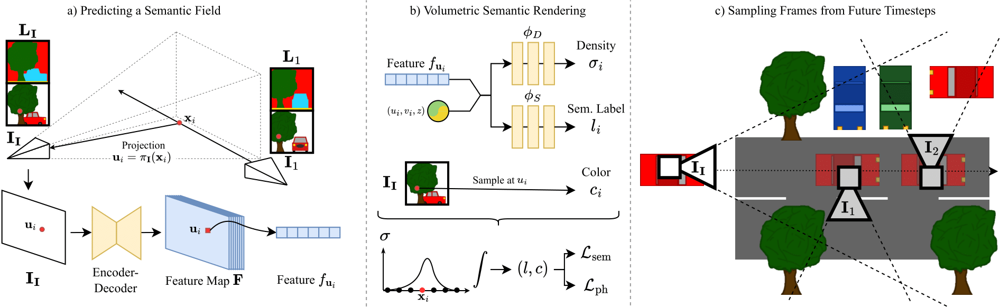

# S4C: Self-Supervised Semantic Scene Completion with Neural Fields

[**Paper**](https://arxiv.org/abs/2310.07522) |  [**Video** (Soon)](#) | [**Project Page**](https://ahayler.github.io/publications/s4c/)

This is the official implementation for the 3DV 2024 paper:

> **S4C: Self-Supervised Semantic Scene Completion with Neural Fields**
>
> [Adrian Hayler](https://ahayler.github.io)<sup> *,1</sup>, [Felix Wimbauer](https://fwmb.github.io)<sup> *,1</sup> , [Dominik Muhle](https://dominikmuhle.github.io/)<sup>1</sup>, [Christian Rupprecht](https://chrirupp.github.io/)<sup>2</sup> and [Daniel Cremers](https://vision.in.tum.de/members/cremers)<sup>1</sup><br>
> <sup>1</sup>Technical University of Munich, <sup>2</sup>Munich Center for Machine Learning, <sup>3</sup>University of Oxford 
> 
> [**3DV Spotlight 2024** (arXiv)](https://arxiv.org/abs/2310.07522)

If you find our work useful, please consider citing our paper:
```
@article{hayler2023s4c,
title={S4C: Self-Supervised Semantic Scene Completion with Neural Fields},
author={Hayler, Adrian and Wimbauer, Felix and Muhle, Dominik and Rupprecht, Christian and Cremers, Daniel},
journal={arXiv preprint arXiv:2310.07522},
year={2023}
}
```

# 📋 Abstract 

Our proposed method can reconstruct a scene from a single image and only relies on videos and pseudo segmentation ground truth generated from off-the-shelf image segmentation network during training.
Unlike existing methods, which use discrete voxel grids, we represent scenes as implicit semantic fields. This formulation allows querying any point within the camera frustum for occupancy and semantic class. Our architecture is trained through rendering-based self-supervised losses.
Nonetheless, our method achieves performance close to fully supervised state-of-the-art methods. Additionally, our method demonstrates strong generalization capabilities and can synthesize accurate segmentation maps for far away viewpoints.

# 👀 Overview



**a)** From an input image $\textbf{I}\_\textbf{I}$, an encoder-decoder network predicts a pixel-aligned feature map $\textbf{F}$ describing a semantic field in the frustum of the image. 
The feature $f\_{\textbf{u}\_i}$ of pixel $\textbf{u}\_i$ encodes the semantic and occupancy distribution on the ray cast from the optical center through the pixel. 
**b)** The semantic field allows rendering novel views and their corresponding semantic segmentation via volumetric rendering. 
A 3D point $\textbf{x}\_i$ is projected into the input image and therefore $\textbf{F}$ to sample $f\_{\textbf{u}\_i}$. Combined with positional encoding of $\textbf{x}_i$, two MLPs decode the density of the point $\sigma\_i$ and semantic label $l\_i$, respectively. 
The color $c\_i$ for novel view synthesis is obtained from other images via color sampling. 
**c)** To achieve best results, we require training views to cover as much surface of the scene as possible. Therefore, we sample side views from random future timesteps, that observe areas of the scene that are occluded in the input frame.

# 🏗️️ Setup

### 🐍 Python Environment

We use **Conda** to manage our Python environment:
```shell
conda env create -f environment.yml
```
Then, activate the conda environment :
```shell
conda activate s4c
```

### 💾 Datasets

All non-standard data (like precomputed poses and datasplits) comes with this repository and can be found in the `datasets/` folder.
In addition, please adjust the `data_path` and `data_segmentation_path` in `configs/data/kitti_360.yaml`.\
We explain how to obtain these datasets in sections [KITTI-360](#KITTI-360) 
and [Pseudo-Ground-Truth Segmentation masks](#pseudo-ground-truth-segmentation-masks).

For the `data_path` the folder you link to should have the following structure:

```shell
calibration 
data_2d_raw
data_2d_semantics
data_3d_bboxes
data_3d_raw
data_poses
```
For the `data_segmentation_path` the folder you link to should have the following structure:

```shell
2013_05_28_drive_0000_sync  2013_05_28_drive_0004_sync  2013_05_28_drive_0007_sync
2013_05_28_drive_0002_sync  2013_05_28_drive_0005_sync  2013_05_28_drive_0009_sync
2013_05_28_drive_0003_sync  2013_05_28_drive_0006_sync  2013_05_28_drive_0010_sync
```


### KITTI-360

To download KITTI-360, go to https://www.cvlibs.net/datasets/kitti-360/index.php and create an account.
We require the perspective images, fisheye images, raw velodyne scans, calibrations, and vehicle poses.

### Pseudo-Ground-Truth Segmentation masks


You can download the pseudo-ground-truth segmentation masks from [here](https://cvg.cit.tum.de/webshare/g/s4c/panoptic_deeplab_R101_os32_cityscapes_hr.zip).

Alternatively, you can generate them yourself. For this we use the [Panoptic Deeplab model zoo (CVPR 2020)](https://github.com/bowenc0221/panoptic-deeplab/tree/master).
First create and activate a new conda environment following the instructions laid out [here](https://github.com/bowenc0221/panoptic-deeplab/blob/master/tools/docs/INSTALL.md). \
You can find the `requirements.txt` file under `\datasets\panoptic-deeplab\requirements.txt`.
You also need to download the [R101-os32 cityscapes baseline model](https://github.com/bowenc0221/panoptic-deeplab/blob/master/tools/docs/MODEL_ZOO.md).

Afterwards, you can run:

```bash
python <path-to-script>/preprocess_kitti_360_segmentation.py \
--cfg datasets/panoptic-deeplab/configs/panoptic_deeplab_R101_os32_cityscapes.yaml \
--output-dir <path-to-output-directory> \
--checkpoint <path-to-downloaded-model>/panoptic_deeplab_R101_os32_cityscapes.pth
```

# 🏋 Training

The training configuration for the model reported on in the paper can be found in the `configs` folder.
Generally, all trainings are run on a single Nvidia A40 GPU with 48GB memory.

**KITTI-360**

```bash
python train.py -cn exp_kitti_360
```

### 📸 Checkpoints

Checkpoints will be added with the release of the camera-ready paper (after the CVPR deadlines).

# 🏃 Running the Example

We provide a script to run our pretrained models with custom data.
The script can be found under `scripts/images/gen_img_custom.py` and takes the following flags:

- `--img <path>` / `i <path>`: Path to input image. The image will be resized to match the model's default resolution.
- `--plot` / `-p`: Plot outputs instead of saving them.
- `--model` / `-m`: Path to the model you want to use.

`media/example/` contains two example images. Note that we use the default projection matrices for the respective datasets 
to compute the density profiles (birds-eye views). 
Therefore, if your custom data comes from a camera with different intrinsics, the output profiles might be skewed.

```bash
# Plot outputs
python scripts/images/gen_img_custom.py --img media/example/0000.png --model /out/kitti_360/<model-name> --plot

# Save outputs to disk
python scripts/images/gen_img_custom.py --img media/example/0000.png --model --model /out/kitti_360/<model-name>
```

# 📊 Evaluation

We provide **not only** a way to evaluate our method (S4C) on the SSCBench KITTI-360 dataset, 
but also a way to easily evaluate/compare other methods. For this, you only need the predictions on the test set 
(sequence 09) saved as `frame_id.npy` files in a folder. \
In addition, we provide the predictions for [LMSCNet](https://github.com/astra-vision/LMSCNet), 
[SSCNet](https://github.com/shurans/sscnet) and [MonoScene](https://github.com/astra-vision/MonoScene).  

## 🐈 S4C on SSCBench KITTI-360

To evaluate our model on the SSCBench KITTI-360 dataset, we need additional data:

### SSCBench KITTI-360 dataset

We require the SSCBench KITTI-360 dataset, which can be downloaded from [here](https://github.com/ai4ce/SSCBench/tree/main/dataset/KITTI-360).
The folder structure you will have to link to looks like:

```bash
calibration  data_2d_raw  preprocess
```

### SSCBench KITTI-360 ground truth

We also need preprocessed ground truth (voxelized ground truth) that belongs to the KITTI-360 SSCBench data. 
The preprocessed data for KITTI-360 in the GitHub Repo was incorrectly generated ([see here](https://github.com/ai4ce/SSCBench/issues/9)).\
Thus, we provide our validated preprocessed ground truth for download [here](https://cvg.cit.tum.de/webshare/g/s4c/voxel_gt.zip).

The folder structure you will have to link to looks like:

```bash
2013_05_28_drive_0000_sync  2013_05_28_drive_0002_sync  2013_05_28_drive_0004_sync  2013_05_28_drive_0006_sync  2013_05_28_drive_0009_sync
2013_05_28_drive_0001_sync  2013_05_28_drive_0003_sync  2013_05_28_drive_0005_sync  2013_05_28_drive_0007_sync  2013_05_28_drive_0010_sync
```

You can now run the evaluation script found at `scripts/benchmarks/sscbench/evaluate_model_sscbench.py` by running:

```bash
python evaluate_model_sscbench.py \
-ssc <path-to-kitti_360-sscbench-dataset> \
-vgt <path-to-preprocessed-voxel-ground-truth> \
-cp <path-to-model-checkpoint> \
-f
```

## 🐱‍👤 Other methods on SSCBench KITTI-360


You can download the predictions for [LMSCNet](https://github.com/astra-vision/LMSCNet), 
[SSCNet](https://github.com/shurans/sscnet) and [MonoScene](https://github.com/astra-vision/MonoScene) here:

- [LMSCNet](https://cvg.cit.tum.de/webshare/g/s4c/lmscnet.zip)
- [SSCNet](https://cvg.cit.tum.de/webshare/g/s4c/sscnet.zip)
- [MonoScene](https://cvg.cit.tum.de/webshare/g/s4c/monoscene.zip)

You can now run the evaluation script found at `scripts/benchmarks/sscbench/evaluate_saved_outputs.py` by running:

```bash
python evaluate_saved_outputs.py
-t
<path-to-preprocessed-voxel-ground-truth>/2013_05_28_drive_0009_sync
-o
<path-to-saved-outputs>
```

Note that both the `-o` and `-t` should point to folders that are filled with files of the form `<frame_id>.npy`.


## ✂️ Ablation studies

Coming soon.

# 🗣️ Acknowledgements

This work was supported by the ERC Advanced Grant SIMULACRON, the GNI project AI4Twinning and the Munich Center for Machine Learning.
C. R. is supported by VisualAI EP/T028572/1 and ERC-UNION-CoG-101001212.

This repository is based on the [BehindTheScenes](https://fwmb.github.io/bts/). 
We evaluate our models on the novel [SSCBench KITTI-360 benchmark](https://github.com/ai4ce/SSCBench). 
We generate our pseudo 2D segmentation ground truth using the [Panoptic Deeplab model zoo](https://github.com/bowenc0221/panoptic-deeplab/tree/master).
